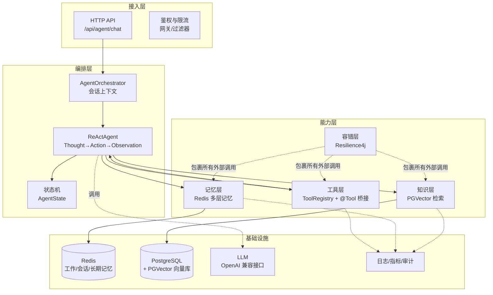
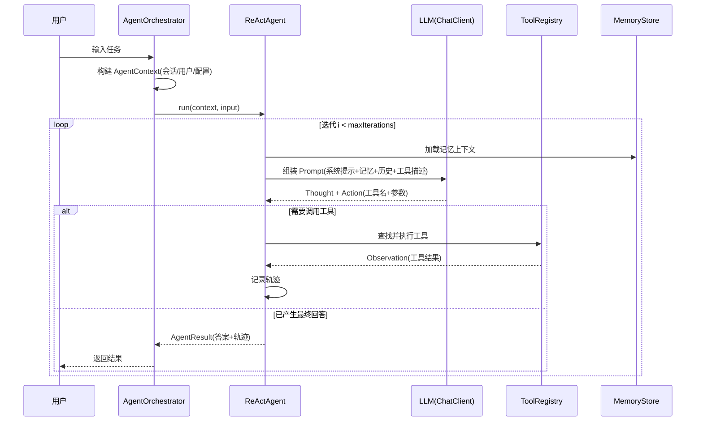

# CosyAgent 企业级 AI 智能体系统设计方案

> 版本：v0.1（Step 1 落地版）
> 技术底座：Java 17 / Spring Boot 3.5.16 / Spring AI 1.1.8 / Redis / PostgreSQL + PGVector / Resilience4j 2.4.0

---

## 1. 项目背景与目标

### 1.1 背景

传统对话系统只能"一问一答"，无法自主完成任务。企业级智能体需要具备：

- **自主规划**：模型理解目标，自行拆解任务并选择执行路径；
- **工具调用**：调用外部能力（查询、计算、写入、通知等）获取信息并产生动作；
- **多轮迭代**：观察工具结果，调整策略，循环直至目标达成；
- **记忆**：跨轮次、跨会话保持上下文与用户画像；
- **知识**：结合企业内部/领域知识库回答，而非仅靠模型参数；
- **可靠**：对模型与外部依赖的抖动具备容错能力；
- **可恢复**：长任务执行中故障后可恢复、可审计。

### 1.2 目标

基于 Spring AI 构建一套**可落地的企业级 ReAct 智能体框架**，按步骤交付：

1. **Step 1（本次）**：搭建基础框架 —— 分层工程骨架、核心契约、工具注册表、统一接口与配置体系，保证工程可编译、可测试、可运行；
2. Step 2 ~ Step 6：逐步接入 ReAct 编排、Redis 多层记忆、PGVector 知识检索、Resilience4j 容错、状态持久化与生产化能力。

### 1.3 设计原则

- **契约先行**：核心能力（记忆、向量、工具、编排）先定义接口，再分步实现，保证各步骤可独立交付与替换；
- **配置驱动**：所有容量/超时/TTL 参数外置到配置，环境变量可覆盖，避免硬编码；
- **容错内置**：从 Step 1 起在依赖层预留 Resilience4j，任何外部调用（LLM、Redis、PG、工具）都落在容错策略内；
- **可观测**：全链路日志 + 执行轨迹记录，便于审计与问题定位。

---

## 2. 总体架构



**分层职责**

| 层 | 职责 | 对应模块 |
| --- | --- | --- |
| 接入层 | HTTP 接口、参数校验、鉴权、并发限流 | `controller` |
| 编排层 | 会话上下文、ReAct 循环、状态推进、终止判定 | `agent.core` / `service` |
| 能力层 | 工具注册与执行、记忆读写、知识检索、容错策略 | `agent.tool` / `agent.memory` / `agent.vector` / `agent.resilience` |
| 基础设施 | Redis、PGVector、LLM、日志监控 | 外部组件 |

---

## 3. 核心技术选型

| 组件 | 版本 | 选型理由 |
| --- | --- | --- |
| Java 17 | LTS | Spring Boot 3.x 基线，长期维护 |
| Spring Boot | 3.5.16 | 稳定维护线，自动装配体系成熟 |
| Spring AI | 1.1.8 | 官方抽象：`ChatClient`、`@Tool` 工具调用、`VectorStore` 向量抽象、模型多厂商切换 |
| Spring Data Redis | Boot 管理 | 多层记忆的 TTL 能力与高性能读写 |
| PostgreSQL + PGVector | 插件 | Spring AI 一等公民支持（`PgVectorStore`），SQL + 向量一体 |
| Resilience4j | 2.4.0 | 与 Spring Boot 3 原生集成，注解 + 声明式配置，支持 Retry/CB/RateLimiter/TimeLimiter/Bulkhead |

> 说明：Spring AI 提供 `spring-ai-bom` 统一管理版本；模型厂商（OpenAI/DeepSeek/Qwen 等兼容接口）通过 `base-url` 切换，不改代码。

---

## 4. ReAct 编排设计（Step 2）

### 4.1 推理循环

ReAct（Reasoning + Acting）核心循环：**思考（Thought）→ 行动（Action）→ 观察（Observation）**。



### 4.2 终止条件

- **自然终止**：模型输出最终答案（无工具调用意图）；
- **强制终止**：达到 `cosy.agent.max-iterations`（默认 8 轮），返回部分结果并标记 `TIMEOUT`；
- **异常终止**：LLM/工具调用连续失败超过容错上限，标记 `FAILED`；
- **取消**：异步场景下支持中断，标记 `CANCELLED`。

### 4.3 状态机

```
INIT → PLANNING → RUNNING ⇄ TOOL_CALLING → COMPLETED
                        │
                        ├─→ FAILED（异常）
                        ├─→ TIMEOUT（超迭代）
                        └─→ CANCELLED（中断）
```

状态在 Step 6 持久化到任务表，支撑长任务恢复与审计。

### 4.4 上下文窗口管理

- 每轮迭代后裁剪历史：保留系统提示 + 最近 N 轮 + 记忆摘要；
- 工具结果超长时截断（默认 4000 字符），避免撑爆上下文；
- 记忆摘要由模型周期性生成（见第 5 节）。

---

## 5. 记忆系统设计：Redis 多层记忆（Step 3）

### 5.1 分层模型

| 层级 | 定位 | 典型内容 | TTL 默认 | Key 前缀 |
| --- | --- | --- | --- | --- |
| L1 工作记忆 | 当前任务执行中的临时状态 | 任务拆解、中间结果、工具输出缓存 | 任务生命周期 | `cosy:work:{session}` |
| L2 会话记忆 | 单会话多轮对话上下文 | 对话历史、摘要、用户当轮意图 | 30 分钟 | `cosy:session:{session}` |
| L3 长期记忆 | 跨会话的用户画像与事实 | 用户偏好、事实、领域规则 | 180 天 | `cosy:long:{user}` |

### 5.2 读写策略

- **写**：每轮迭代结束后异步写入 L2（对话历史）；关键事实抽取后写入 L3；工具中间结果写 L1；
- **读**：每次 LLM 调用前，按 L3 → L2 → L1 顺序合并为记忆上下文注入 Prompt；
- **遗忘**：依赖 Redis TTL 自动过期；L2 摘要采用"滚动摘要"——上下文超过阈值时由模型压缩为摘要后替换；
- **检索**：L3 长期记忆按关键词/向量语义检索（Step 3 用 Redis Search，Step 4 后可向量化），取 TopK 命中注入。

### 5.3 Redis Key 设计

```
cosy:work:{sessionId}:{taskId}      # 当前任务状态（Hash，TTL=任务级）
cosy:session:{sessionId}:messages   # 会话消息列表（List，TTL=30m）
cosy:session:{sessionId}:summary    # 会话滚动摘要（String，TTL=30m）
cosy:long:{userId}:fact:{factId}    # 长期事实（String，TTL=180d）
cosy:lock:{taskId}                  # 任务并发锁（用于幂等/防重入）
```

---

## 6. 知识检索设计：PGVector（Step 4）

### 6.1 处理链路

```
文档 → 切分（分块 500~800 字符，重叠 50）→ Embedding（模型向量化）→ PgVectorStore 入库（含元数据）
查询 → Embedding → 相似度检索（TopK + 最小分数阈值）→ 结果注入 Prompt（RAG）
```

### 6.2 关键决策

- **存储**：`spring-ai-starter-vector-store-pgvector`，Spring AI 自动建表 `vector_store`（`id`、`content`、`metadata`、`embedding`）；
- **命名空间**：按 `namespace`（业务域/租户）隔离，避免跨域串扰；
- **检索参数**：`topK=5`、最小相似度阈值 0.7（按模型向量空间可调）；
- **混合检索**（进阶）：PGVector 向量检索 + PostgreSQL 全文检索（`tsvector`）加权融合，提升专业术语召回；
- **版本一致性**：Embedding 模型固定版本，模型升级需重建向量（记录模型指纹于元数据）。

---

## 7. 容错设计：Resilience4j（Step 5）

### 7.1 策略落点矩阵

| 调用对象 | Retry | CircuitBreaker | RateLimiter | TimeLimiter | Bulkhead |
| --- | :-: | :-: | :-: | :-: | :-: |
| LLM 推理（ChatClient） | ✅ 3 次退避 | ✅ 慢调用/失败熔断 | ✅ | ✅ 60s | ✅ 并发隔离 |
| 工具调用（外部 API） | ✅ 幂等工具 2 次 | ✅ | ✅ | ✅ 30s | ✅ |
| Redis 记忆读写 | ✅ | ✅ | — | ✅ 2s | — |
| PGVector 检索 | ✅ | ✅ | — | ✅ 5s | — |

### 7.2 降级策略

- **LLM 熔断**：返回降级文案"模型服务暂时不可用"，保留会话上下文以便恢复；
- **记忆降级**：降级为无记忆直答（仍返回结果，仅丢失上下文）；
- **知识检索降级**：跳过 RAG 直接回答，并在结果中标注"未使用知识库"；
- **工具失败**：错误作为 Observation 回传模型，由模型决定更换工具或终止（ReAct 天然容错）。

### 7.3 配置形态（Step 5 启用，示例）

```yaml
resilience4j:
  retry:
    instances:
      llm-retry:
        max-attempts: 3
        wait-duration: 2s
        retry-exceptions: [org.springframework.ai.retry.NonTransientAiException]
  circuitbreaker:
    instances:
      llm-cb:
        sliding-window-size: 20
        failure-rate-threshold: 50
        wait-duration-in-open-state: 30s
```

---

## 8. 状态持久化设计（Step 6）

| 存储 | 内容 | 说明 |
| --- | --- | --- |
| Redis | 会话快照、执行中任务状态 | 热状态，TTL 兜底 |
| PostgreSQL | 任务表、执行轨迹表、记忆审计表 | 冷存储，审计与恢复 |

**任务表草案**

```sql
CREATE TABLE agent_task (
    task_id       VARCHAR(64) PRIMARY KEY,
    session_id    VARCHAR(64) NOT NULL,
    user_id       VARCHAR(64) NOT NULL,
    state         VARCHAR(32) NOT NULL,   -- AgentState
    input         TEXT,
    output        TEXT,
    iterations    INT DEFAULT 0,
    created_at    TIMESTAMP DEFAULT now(),
    updated_at    TIMESTAMP DEFAULT now(),
    finished_at   TIMESTAMP
);

CREATE TABLE agent_trace (
    id           BIGSERIAL PRIMARY KEY,
    task_id      VARCHAR(64) NOT NULL,
    seq          INT NOT NULL,
    role         VARCHAR(16) NOT NULL,    -- SYSTEM/USER/ASSISTANT/TOOL
    content      TEXT,
    tool_name    VARCHAR(128),
    created_at   TIMESTAMP DEFAULT now()
);
```

恢复机制：任务中断后，读取 `agent_task` + `agent_trace` 重建 `AgentContext` 与历史，从断点继续迭代。

---

## 9. 可观测性与安全

- **日志**：每轮迭代打印 Thought/Action/Observation（脱敏后）；全局异常统一收敛；
- **指标**：Actuator 暴露 `metrics`，统计迭代次数、工具调用耗时、容错触发次数；
- **审计**：`agent_trace` 完整记录工具调用参数与结果，满足合规追溯；
- **安全**：
  - 工具白名单 + 权限映射（按用户/角色控制可用工具）；
  - Prompt 注入防护：工具结果作为数据而非指令处理，敏感操作（写库/发消息）二次确认；
  - 密钥管理：API Key 走环境变量/密钥托管，不入代码库（见 `.gitignore`）。

---

## 10. 分步实施计划

| 步骤 | 目标 | 关键交付物 | 验收标准 |
| --- | --- | --- | --- |
| **Step 1**（本次） | 基础框架 | Maven 工程、分层骨架、核心契约（Agent/Tool/Memory/Vector）、ToolRegistry、统一接口、配置体系、测试 | 工程可编译；`mvn test` 通过；服务可启动；接口可调用 |
| Step 2 | ReAct 编排 | ReActAgent 实现、ChatClient 接入、ToolRegistry → Spring AI `@Tool` 桥接、迭代与终止逻辑 | 真实 LLM Key 下可完成"规划→调用工具→多轮→回答"闭环 |
| Step 3 | Redis 多层记忆 | RedisMemoryStore 实现、滚动摘要、长期事实抽取 | 跨会话长期记忆命中；会话恢复不丢上下文 |
| Step 4 | PGVector 知识检索 | 文档入库管线、RAG 检索注入 | 知识库问答命中率达标；命名空间隔离生效 |
| Step 5 | Resilience4j 容错 | 策略配置 + 降级实现 + 容错指标 | 模拟 LLM/Redis 故障时系统不雪崩、可降级 |
| Step 6 | 持久化与生产化 | 任务状态机、轨迹持久化、鉴权、部署（Docker/K8s） | 任务断点恢复；审计轨迹完整；可灰度上线 |

每步独立可交付、可回滚；后续步骤不破坏 Step 1 契约（接口稳定是硬约束）。

---

## 11. Step 1 交付说明

### 11.1 已落地内容

- 分层工程骨架（`common / config / agent.core / agent.tool / agent.memory / agent.vector / agent.resilience / service / controller`）；
- 核心契约：`AgentState`、`AgentMessage`、`AgentContext`、`AgentResult`、`ReActAgent`（接口）、`AgentTool`、`ToolRegistry`、`MemoryLevel`、`MemoryStore`、`VectorKnowledgeStore`；
- 示例工具：`get_server_time`、`get_server_info`（验证注册表链路）；
- 统一响应/错误码/全局异常处理；
- 配置体系：`cosy.agent.*` 与外部依赖全部环境变量化；
- 测试：上下文加载测试、工具注册表单测、HTTP 接口集成测试。

### 11.2 运行与验证

```bash
mvn test                        # 全部测试通过
mvn spring-boot:run             # 启动（无需 Redis/LLM，Step 1 不发起外部连接）

curl http://localhost:8080/api/agent/status
curl http://localhost:8080/api/agent/tools
curl -X POST http://localhost:8080/api/agent/chat \
  -H 'Content-Type: application/json' -d '{"sessionId":"s1","message":"你好"}'
```

### 11.3 仓库地址

`https://github.com/Han03/CosyAgent.git`（Step 1 代码已推送 main 分支）

---

## 12. 风险与演进

| 风险 | 应对 |
| --- | --- |
| 模型上下文窗口限制 | 滚动摘要 + 轨迹裁剪（第 4.4 节） |
| 工具调用幻觉（参数错误） | 工具参数 JSON Schema 校验 + 失败 Observation 回传重试 |
| 长任务不可控 | 最大迭代上限 + 任务超时 + 状态持久化可恢复 |
| 向量召回质量波动 | 阈值/TopK 调参 + 混合检索 + 向量重建流程 |
| 外部依赖抖动 | Resilience4j 全链路覆盖 + 降级路径明确 |

**演进方向**：多 Agent 协作（Planner/Executor 拆分）、流式输出（SSE）、插件化工具市场、评估集（Agent Eval）自动化回归。
