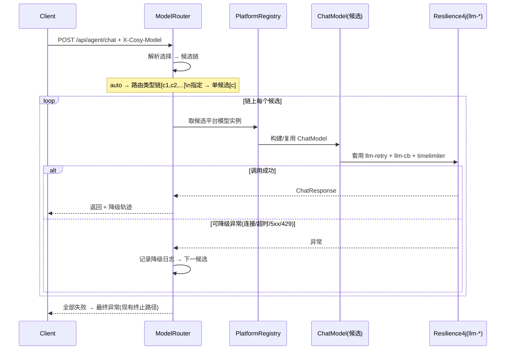

# 模型路由设计方案（CosyAgent Model Routing）

> 版本：v2.0・适用服务端 CosyAgent（Spring Boot 3.5 + Spring AI）与客户端 CosyAgentClient（Flutter）
> 关联文档：
>
> `CosyAgent设计方案.md`
>
> 、
>
> `LLM Mock 端到端模块设计方案.md`
>
> 、
>
> `接口文档.md`
> **v2.0 调整（相对 v1）**
>
> ：模型路由配置
>
> **不再由客户端下发**
>
> ，权威来源改为
>
> **后端**
>
> （YAML 默认 + 管理 API 热更新）；客户端会话界面提供
>
> **模型选择器**
>
> （指定模型 / 默认 Auto 自动路由），与主流 Agent 工具交互一致。


***

## 1. 背景与目标

### 1.1 现状


* 服务端**单一 ChatModel**：`AgentChatConfig` 只构建一个 OpenAI 兼容模型，一次启动绑定一个供应商 + 一个模型，切换靠环境变量静态配置（重启生效）。

* 所有请求走同一模型；无运行时选型、无降级切换。

### 1.2 目标


1. **多平台多模型**：注册多个 OpenAI 兼容平台（OpenAI / DeepSeek / Qwen / 自定义…），每平台可配多模型。

2. **按顺序降级**：路由链上前置候选失败（连接失败 / 超时 / 5xx / 429）自动切换下一候选，全部失败才报错。

3. **配置权威在后端**：平台与路由链由服务端管理（YAML 默认 + 管理 API 热更新，可持久化），客户端**不携带、不编辑**完整配置。

4. **会话界面模型选择**（对齐市场 Agent 工具）：聊天页可**指定模型**，或默认 **Auto** 由后端自动路由。

5. 与现有 **Mock 模块、Resilience4j 容错、ReAct 编排、记忆 / 任务持久化** 兼容。


***

## 2. 核心概念


| 概念               | 说明                                              | 示例                                                       |
| ---------------- | ----------------------------------------------- | -------------------------------------------------------- |
| 模型平台（Platform）   | 一个 OpenAI 兼容供应商实例（base-url + api-key），**配置在后端** | `openai`、`deepseek`                                      |
| 模型（Model）        | 平台上具体模型标识                                       | `gpt-4o-mini`、`deepseek-chat`                            |
| 候选（Candidate）    | `平台/模型` 组合，路由链上一个元素                             | `openai/gpt-4o-mini`                                     |
| 路由类型（Route Type） | 调用场景标签，决定 auto 走哪条链                             | `default`、`reasoning`                                    |
| 路由配置（Route）      | 路由类型 → **有序候选链**（降级顺序）                          | `default → [openai/gpt-4o-mini, deepseek/deepseek-chat]` |
| **Auto 模式**      | 客户端不指定模型 → 后端按路由类型链自动路由 + 降级（默认）                | —                                                        |
| **指定模型**         | 客户端显式选 `平台/模型` → 单候选执行（不跨模型降级）                  | `deepseek/deepseek-reasoner`                             |

**降级语义**：链按声明顺序尝试；候选调用抛 "可降级异常" 时记录日志并切下一候选；全部失败抛最终异常（进入现有容错 / 终止路径）。**指定模型**退化为单候选链 —— 仍套重试 / 熔断 / 超时，但不跨模型切换（与 Cursor 等工具 "指定即锁定" 一致）。


***

## 3. 总体架构


```mermaid
flowchart LR
  subgraph Client[Flutter 客户端]
    Chat[聊天页\n模型选择器 Auto/指定]
    Settings[设置页\n仅连接/Mock 等基础配置]
  end

  subgraph Server[CosyAgent 服务端]
    Ctrl[AgentController]
    Route[ModelRouter\n候选链解析 + 降级]
    ReAct[DefaultReActAgent]
    Mock[MockModel\n端到端 Mock]
    Reg[ModelPlatformRegistry]
    Store[ModelRoutingConfigStore\nmemory / pg / mysql]
    Admin[管理 API\nGET/PUT 路由配置 + catalog]
    RL4J[Resilience4j\nllm-retry / llm-cb / timelimiter]

    Ctrl --> Route
    Route -->|Mock 开启/请求覆盖| Mock
    Route -->|Auto| Reg
    Route -->|指定模型| Reg
    Reg --> RL4J
    ReAct --> Route
    Admin --> Store
    Store -->|运行时配置| Route
  end

  Chat -->|X-Cosy-Model: auto\|platform/model| Ctrl
  Chat -->|GET catalog 模型列表| Admin
```

**配置流**：后端 Store（YAML 默认 + 管理 API 更新）→ 路由引擎读取。**选择流**：客户端只传 `X-Cosy-Model`（auto 或具体模型），不携带配置本体。


***

## 4. 配置结构（后端权威）

### 4.1 静态默认（YAML）


```
cosy:

&#x20; agent:

&#x20;   model-routing:

&#x20;     enabled: \${COSY\_MODEL\_ROUTING\_ENABLED:true}

&#x20;     max-candidates: \${COSY\_MODEL\_ROUTING\_MAX\_CANDIDATES:5}   # 单链候选上限

&#x20;     platforms:

&#x20;       openai:                       # 平台名（唯一标识）

&#x20;         base-url: \${OPENAI\_BASE\_URL:https://api.openai.com}

&#x20;         api-key: \${OPENAI\_API\_KEY:sk-demo}

&#x20;       deepseek:

&#x20;         base-url: \${DEEPSEEK\_BASE\_URL:https://api.deepseek.com}

&#x20;         api-key: \${DEEPSEEK\_API\_KEY:}

&#x20;     routes:

&#x20;       default:                      # Auto 模式默认链（降级顺序）

&#x20;         - openai/gpt-4o-mini

&#x20;         - deepseek/deepseek-chat

&#x20;       reasoning:

&#x20;         - openai/gpt-4o

&#x20;         - deepseek/deepseek-reasoner
```


* `enabled=false` 时退化为现状：仅用 `spring.ai.openai.*` 单模型（兼容旧部署）。

* YAML 为**启动基线**；管理 API 更新后进入运行时配置（覆盖 YAML），重启后按持久化 store 恢复，无 store 则回 YAML。

### 4.2 管理 API（配置读写，`/api/**` 受现有 X-API-Key 鉴权保护）


| 接口                                     | 说明                                                                    |
| -------------------------------------- | --------------------------------------------------------------------- |
| `GET /api/agent/model-routing`         | 读当前配置（platforms 的 api-key **打码回显**，仅显示是否已配置）                          |
| `PUT /api/agent/model-routing`         | 全量更新配置；api-key 字段传空 = 保持原值；变更**即时生效**（热更新）                            |
| `GET /api/agent/model-routing/catalog` | 客户端模型选择器数据源：`{ "models": ["openai/gpt-4o-mini", ...], "auto": true }` |

`catalog.models` = 所有路由链中引用的候选模型**去重合并**（供 "指定模型" 选择）；`auto` 恒为默认项（走 `default` 链）。

### 4.3 配置持久化（复用 task store 三实现模式）


| Store          | 行为                                                                           |
| -------------- | ---------------------------------------------------------------------------- |
| `memory`（默认）   | 运行时内存态，重启回 YAML 基线                                                           |
| `pg` / `mysql` | 表 `model_platform` / `model_route` 持久化，重启自动恢复；与 `COSY_AGENT_TASK_STORE` 同库同源 |

> 设计上与 
>
> `TaskStore`
>
>  保持一致：接口 
>
> `ModelRoutingConfigStore`
>
>  \+ 三实现 + 启动自动建表迁移。api-key 明文存后端存储（本地部署可接受；生产演进：字段加密）。


***

## 5. 后端设计

### 5.1 新增组件（`com.cosy.agent.agent.router` 包）


| 组件                        | 职责                                                                           |
| ------------------------- | ---------------------------------------------------------------------------- |
| `ModelRouter`             | 路由入口：`ChatResponse call(RouteRequest req)`；解析选择（auto / 指定）→ 取候选链 → 逐个调用 → 降级 |
| `ModelPlatformRegistry`   | 平台注册表：按名注册 `ModelPlatform`；延迟构建并缓存 `OpenAiChatModel`                         |
| `RouteConfig`             | 路由配置模型（platforms + routes）；YAML 与 Store 统一映射                                 |
| `ModelRoutingConfigStore` | 配置存取接口：`load()` / `save(RouteConfig)`；memory /pg/mysql 三实现                   |
| `ModelRoutingAdmin`       | 管理 API 服务：读配置（key 打码）、写配置（空 key 保持）、catalog 组装                               |
| `RouteRequest`            | `(modelChoice, routeType, Prompt)`：modelChoice = auto \| 具体候选                |
| `RouteResult`             | 调用结果 + 降级轨迹（命中候选、切换次数、各候选耗时）                                                 |

### 5.2 请求协议（客户端 → 后端）


| 请求头            | 值                                   | 说明                                                               |
| -------------- | ----------------------------------- | ---------------------------------------------------------------- |
| `X-Cosy-Model` | `auto`（缺省同义）\| `openai/gpt-4o-mini` | **auto**：后端按路由类型（当前固定 `default`）链执行 + 降级；**指定**：单候选执行（锁定，不跨模型降级） |
| `X-Cosy-Mock`  | `true` / `false`                    | 保持现状：开启时短路 MockModel，不进入模型路由                                     |

> 客户端
>
> **不再发送**
>
> 完整路由配置（v1 的 
>
> `X-Cosy-Model-Routes`
>
>  取消）；路由类型暂由后端固定（
>
> `default`
>
> ），"按任务自动分类" 列为演进项。

### 5.3 路由调用链




**关键约束**：


* **会话连续性**：降级只切换 `ChatModel` 实例，`Prompt` 消息序列（含历史）原样传给下一候选 → 多轮对话不受影响。

* **可降级异常**：连接失败、超时（timelimiter）、`5xx`、`429`（限流）。**不可降级**：`4xx` 客户端错误（400 参数 / 401 鉴权 —— 切模型无意义，直接抛）。

* **Mock 优先级**：`X-Cosy-Mock: true`（或 `COSY_AGENT_MOCK_ENABLED=true`）直接走 `MockModel`，不进入模型路由。

* **容错叠加**：每个候选调用外层套现有 `llm-retry` + `llm-cb` + `llm-timelimiter`；候选间降级在链层（不重复重试）。熔断按候选动态命名（`llm-cb-<platform>-<model>`）列为演进项。

### 5.4 ReAct 改造点


* `DefaultReActAgent` 当前直接持有 `ChatModel` + `OpenAiChatOptions`。

* 改造为持有 `ModelRouter`（注入 `RouteRequest` 构造）；Mock 关闭时路由走真实候选链，Mock 开启时路由内部短路到 MockModel（对 ReAct 透明）。

* `AgentChatConfig` 保留为 "默认单模型回退路径"（`enabled=false` 直接注入原 ChatModel），不破坏旧测试。

### 5.5 观测与日志


* 每次路由输出 `RouteResult` 轨迹：`choice → 候选链 → 实际命中 → 切换原因（异常类型/耗时）`。

* 日志示例：


```
\[router] choice=auto route=default chain=\[openai/gpt-4o-mini, deepseek/deepseek-chat]

\[router] candidate openai/gpt-4o-mini FAILED (timeout 30000ms) -> fallback

\[router] candidate deepseek/deepseek-chat OK (2850ms)
```


* 轨迹写入 `agent_trace`（复用 Step 6 任务轨迹表，扩展 `route_trace` JSON）。


***

## 6. 客户端设计（Flutter）

### 6.1 会话界面模型选择器（核心交互，对齐 Agent 工具）

聊天页 AppBar 下方（或输入区上方）常驻一行模型选择器：


```
\[ Auto ▾ ]  ← 默认；也可选具体模型

├─ Auto（自动路由，后端按链选择并降级）

├─ openai/gpt-4o-mini

├─ openai/gpt-4o

├─ deepseek/deepseek-chat

└─ deepseek/deepseek-reasoner
```


* **Auto**：默认项，请求携带 `X-Cosy-Model: auto`，后端按 `default` 链路由 + 降级。

* **指定模型**：选中即锁定该模型（单候选，失败不跨模型降级）。

* **数据源**：启动 / 进入聊天页时 `GET /api/agent/model-routing/catalog` 拉取；失败或接口 404（旧后端）时仅显示 Auto，不阻断使用。

* **选择持久化**：客户端本地保存全局默认（`cosy.defaultModel`）；会话维度列为演进项。

* **切换即时生效**：下拉切换后，后续消息按新选择发送；当前消息发出后不可中途更换。

### 6.2 设置页调整


* **移除** v1 规划的 "模型平台管理 / 路由编辑器"（配置归后端，客户端不再编辑、不再携带配置）。

* 保留：服务地址、API Key、Mock 开关。

* 可选补充：设置页只读展示当前后端路由配置（调 `GET /api/agent/model-routing`，api-key 打码），便于了解后端有哪些模型可选 —— 不提供编辑。

### 6.3 数据流


```
后端配置(Store) → catalog API → 客户端模型选择器

客户端选择 Auto/指定 → 请求头 X-Cosy-Model → 后端 ModelRouter → 候选链/单候选 → 降级 → 响应
```


***

## 7. 边界与安全


| 项          | 决策                              | 说明                                   |
| ---------- | ------------------------------- | ------------------------------------ |
| api-key 存储 | 仅存后端（YAML/env 或管理 API 写入 Store） | 客户端不再持有；Store 持久化明文（生产演进：加密）         |
| 管理 API 鉴权  | `/api/**` 受现有 X-API-Key 保护      | 配置 `COSY_AGENT_API_KEY` 后管理 API 一并生效 |
| 配置即时性      | PUT 热更新，无需重启                    | 变更后下一请求生效                            |
| 模型列表口径     | catalog = 路由链引用的候选去重            | 客户端不能指定链外模型（防错配）                     |
| 兼容回退       | `enabled=false` 走旧单模型           | 不影响现有测试与部署；客户端无 catalog 时仅显示 Auto    |


***

## 8. 实施计划


| Step        | 内容                                                                                                                                    | 验收                                          |
| ----------- | ------------------------------------------------------------------------------------------------------------------------------------- | ------------------------------------------- |
| **R1 后端骨架** | `agent.router` 包：`ModelRouter` / `ModelPlatformRegistry` / `RouteConfig`；YAML 配置；候选链降级执行；`X-Cosy-Model`（auto / 指定）解析；`RouteResult` 轨迹 | 单元测试：候选 1 失败自动切候选 2；指定模型锁定单候选不降级            |
| **R2 配置管理** | `ModelRoutingConfigStore`（memory/pg/mysql）+ 管理 API（GET/PUT/catalog）+ key 打码 + 热更新                                                     | 集成测试：PUT 后即时生效、重启按 store 恢复、catalog 正确去重    |
| **R3 客户端**  | 聊天页模型选择器（Auto + 模型列表）、catalog 拉取降级、本地持久化、请求头携带；设置页移除编辑器                                                                               | 联调：Auto 走链降级、指定模型锁定；旧后端无 catalog 时仅 Auto 可用 |
| **R4 收尾**   | 文档落地说明、`接口文档.md` 增补路由头与管理 API、README 配置示例                                                                                             | 全链路冒烟（真实平台或 mock 关闭验证）                      |

**演进项（不在本期）**：会话级模型选择（per-session 记忆）；按任务语义自动路由（`RouterTypeResolver` 可插拔）；熔断实例按候选动态命名；api-key 存储加密。