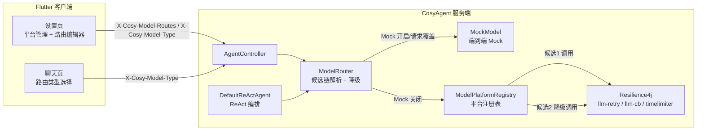
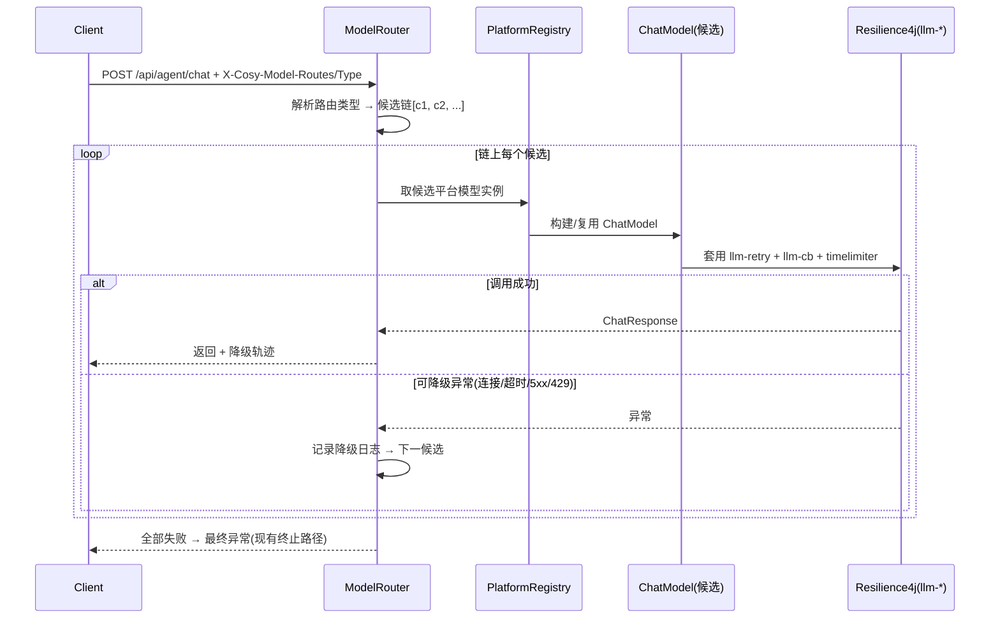

# 模型路由设计方案（CosyAgent Model Routing）

> 版本：v1.0 · 适用服务端 CosyAgent（Spring Boot 3.5 + Spring AI）与客户端 CosyAgentClient（Flutter）
> 关联文档：`CosyAgent设计方案.md`、`LLM Mock 端到端模块设计方案.md`、`接口文档.md`

---

## 1. 背景与目标

### 1.1 现状

- 服务端**单一 ChatModel**：`AgentChatConfig` 只构建一个 OpenAI 兼容模型，一次启动绑定一个供应商 + 一个模型。
- 切换靠环境变量静态配置（`OPENAI_BASE_URL` / `OPENAI_API_KEY` / `OPENAI_CHAT_MODEL`），重启才生效。
- 所有请求（无论任务类型）走同一模型；无运行时选型、无降级切换。

### 1.2 目标

1. **多平台多模型**：注册多个 OpenAI 兼容平台（OpenAI / DeepSeek / Qwen / 自定义…），每个平台可配多个模型。
2. **按路由类型选型**：为每个"路由类型"（如 `default` 日常对话、`reasoning` 复杂推理）指定一条**有序模型链**。
3. **按顺序降级**：链上前置候选失败（连接失败 / 超时 / 5xx / 429）时自动切换下一个候选，全部失败才报错。
4. **客户端可配置**：客户端设置页提供"模型平台管理 + 路由配置"UI，编辑结果即时下发后端生效，无需重启。
5. 与现有 **Mock 模块、Resilience4j 容错、ReAct 编排、记忆/任务持久化** 兼容。

---

## 2. 核心概念

| 概念 | 说明 | 示例 |
|---|---|---|
| 模型平台（Platform） | 一个 OpenAI 兼容供应商实例（base-url + api-key） | `openai`、`deepseek`、`qwen` |
| 模型（Model） | 平台上具体模型标识 | `gpt-4o-mini`、`deepseek-chat` |
| 候选（Candidate） | `平台/模型` 组合，路由链上的一个元素 | `openai/gpt-4o-mini` |
| 路由类型（Route Type） | 调用场景标签，决定走哪条链 | `default`、`reasoning`、`knowledge` |
| 路由配置（Route） | 路由类型 → **有序候选链**（降级顺序） | `default → [openai/gpt-4o-mini, deepseek/deepseek-chat]` |

**降级语义**：链按声明顺序尝试；候选调用抛"可降级异常"时记录日志并切下一个候选；全部失败抛出最终异常（进入现有容错/终止路径）。

---

## 3. 总体架构



**配置来源优先级**：请求头（客户端下发） > 静态 YAML（服务端默认）。二者为同一结构，路由引擎无状态执行。

---

## 4. 配置结构

### 4.1 服务端静态默认（YAML）

```yaml
cosy:
  agent:
    model-routing:
      enabled: ${COSY_MODEL_ROUTING_ENABLED:true}
      max-candidates: ${COSY_MODEL_ROUTING_MAX_CANDIDATES:5}   # 单链候选上限（防超长请求头）
      platforms:
        openai:                       # 平台名（唯一标识）
          base-url: ${OPENAI_BASE_URL:https://api.openai.com}
          api-key: ${OPENAI_API_KEY:sk-demo}
        deepseek:
          base-url: ${DEEPSEEK_BASE_URL:https://api.deepseek.com}
          api-key: ${DEEPSEEK_API_KEY:}
      routes:
        default:                      # 路由类型 → 有序候选链（降级顺序）
          - openai/gpt-4o-mini
          - deepseek/deepseek-chat
        reasoning:
          - openai/gpt-4o
          - deepseek/deepseek-reasoner
```

- `enabled=false` 时退化为现状：仅用 `spring.ai.openai.*` 单模型（兼容旧部署）。
- 平台配置缺省回退：未配置平台但 `spring.ai.openai.*` 存在时，自动注册名为 `openai` 的平台。

### 4.2 请求级覆盖（客户端下发，与 Mock 一致的 header 模式）

| 请求头 | 值 | 说明 |
|---|---|---|
| `X-Cosy-Model-Routes` | `base64url(JSON)` | 完整路由配置（平台 + 路由链），客户端设置页编辑后随请求携带 |
| `X-Cosy-Model-Type` | `default` / `reasoning` / 自定义 | 本次请求走哪条路由链；缺省 `default` |

**JSON 结构**（与 YAML 同构）：

```json
{
  "platforms": {
    "openai":  { "base-url": "https://api.openai.com",  "api-key": "sk-xxx" },
    "deepseek": { "base-url": "https://api.deepseek.com", "api-key": "sk-yyy" }
  },
  "routes": {
    "default":   ["openai/gpt-4o-mini", "deepseek/deepseek-chat"],
    "reasoning": ["openai/gpt-4o", "deepseek/deepseek-reasoner"]
  }
}
```

解析优先级：**请求头 `X-Cosy-Model-Routes` > 静态 YAML**；路由类型缺省 `default`；链中引用未注册平台 → 跳过该候选并告警日志。

---

## 5. 后端设计

### 5.1 新增组件（`com.cosy.agent.agent.router` 包）

| 组件 | 职责 |
|---|---|
| `ModelRouter` | 路由入口：`ChatResponse call(RouteRequest req)`；解析路由类型 → 取候选链 → 逐个调用 → 降级 |
| `ModelPlatformRegistry` | 平台注册表：按名注册 `ModelPlatform`（base-url/api-key）；运行时构建 `OpenAiChatModel`（延迟初始化、按平台缓存） |
| `RouteConfig` | 路由配置模型（platforms + routes）；静态 YAML 与请求头 JSON 统一映射 |
| `RouteRequest` | `(routeType, Prompt)` 包装：Prompt 携带消息历史、工具定义、ChatOptions |
| `RouteResult` | 调用结果 + 降级轨迹（实际命中候选、切换次数、各候选耗时） |

### 5.2 路由调用链



**关键约束**：

- **会话连续性**：降级只切换 `ChatModel` 实例，`Prompt` 消息序列（含历史）原样传给下一候选 → 多轮对话不受影响。
- **可降级异常**：`ConnectionError`、超时（timelimiter）、`5xx`、`429`（限流）。
- **不可降级异常**：`4xx` 客户端错误（400 参数/401 鉴权——切模型无意义，直接抛）。
- **Mock 优先级**：`X-Cosy-Mock: true`（或全局 `COSY_AGENT_MOCK_ENABLED=true`）时直接走 `MockModel`，**不进入**模型路由；关闭 mock 才走 `ModelRouter`。
- **容错叠加**：每个候选调用外层套现有 `llm-retry`（重试 3 次）+ `llm-cb`（熔断）+ `llm-timelimiter`；候选间降级在链层（链层不再重复重试）。熔断实例沿用命名约定，候选可映射到 `llm-cb-<platform>-<model>` 动态实例（演进项，见 §8）。

### 5.3 ReAct 改造点

- `DefaultReActAgent` 当前直接持有 `ChatModel` + `OpenAiChatOptions`。
- 改造为持有 `ModelRouter`（注入 `RouteRequest` 构造）；Mock 关闭时路由走真实候选链，Mock 开启时路由内部短路到 MockModel（**对 ReAct 透明**）。
- 现有 `AgentChatConfig` 保留为"默认单模型回退路径"（`enabled=false` 时直接注入原 ChatModel），不破坏旧测试。

### 5.4 观测与日志

- 每次路由输出 `RouteResult` 降级轨迹：`routeType → 候选链 → 实际命中 -> 切换原因（异常类型/耗时）`。
- 日志示例：
  ```
  [router] route=default chain=[openai/gpt-4o-mini, deepseek/deepseek-chat]
  [router] candidate openai/gpt-4o-mini FAILED (timeout 30000ms) -> fallback
  [router] candidate deepseek/deepseek-chat OK (2850ms)
  ```
- 降级轨迹写入 `agent_trace`（复用 Step 6 任务轨迹表，字段扩展 `route_trace` JSON）。

---

## 6. 客户端设计（Flutter）

### 6.1 设置页新增区块

设置页新增 **"模型路由"** 区（与现有"服务连接 / Mock 开关"并列）：

```
模型路由
┌─────────────────────────────────────┐
│ 启用模型路由            [开关]        │
│ 路由类型（聊天页默认）   [default ▾]   │
├─────────────────────────────────────┤
│ 模型平台                          │
│   openai    https://api.openai.com  [编辑][删除]│
│   deepseek  https://api.deepseek.com [编辑][删除]│
│   [ + 添加平台 ]                     │
├─────────────────────────────────────┤
│ 路由配置                            │
│   default   openai/gpt-4o-mini      │
│             ↓ deepseek/deepseek-chat│
│            [编辑][删除]              │
│   reasoning openai/gpt-4o           │
│             ↓ deepseek/deepseek-reasoner│
│   [ + 添加路由 ]                     │
├─────────────────────────────────────┤
│ [测试路由]   （逐候选 ping，展示每级结果）│
└─────────────────────────────────────┘
```

### 6.2 交互与持久化

- **平台编辑器**：名称 / base-url / api-key 三字段表单；校验 base-url 合法性、名称唯一。
- **路由编辑器**：选择路由类型（或自定义名称）→ 候选链编辑器（下拉选平台 → 下拉选模型 / 手动输入模型名；可上移/下移/删除候选；新增候选追加到链尾 = 降级顺序）。
- **持久化**：配置以 JSON 存入 `FlutterSecureStorage`（key `cosy.modelRoutes`，与 mock 开关一致）；仅本地保存，随请求头发送。
- **聊天页路由类型**：设置页选"默认路由类型"，请求统一携带；会话级切换作为演进项（§8）。
- **测试路由**：逐候选调 `GET /api/agent/status`（平台连通）→ 展示每级"可达/失败"，失败不阻断后续候选展示；不做真实模型调用（避免耗 token）。

### 6.3 数据流

```
设置页编辑 → 本地持久化(JSON) → 聊天请求携带
  X-Cosy-Model-Routes: base64url(JSON)
  X-Cosy-Model-Type: <routeType>
→ 后端 ModelRouter 解析 → 候选链 → 降级 → 响应
```

### 6.4 与 Mock 的关系

- Mock 开启：请求携带 `X-Cosy-Mock: true`，**后端短路到 MockModel**，路由配置不参与执行（可编辑但不生效）。
- Mock 关闭：走真实模型路由（本设计的主场景）。

---

## 7. 边界与安全

| 项 | 决策 | 说明 |
|---|---|---|
| api-key 传输 | 请求头明文 | 本地/局域网部署可接受；跨公网建议 HTTPS 或改用"配置存后端 + 引用平台 ID"（演进项） |
| 请求头大小 | 单链 ≤5 候选、平台 ≤8 个（后端强制裁剪） | Tomcat 默认 max-http-header-size 8KB 足够 |
| 平台模型一致性 | 候选引用未注册平台 → 跳过 + 告警 | 防客户端误配导致整链失效 |
| 密钥管理 | api-key 仅客户端本地保存，不写入后端存储 | 与现有 mock 开关同一存储通道 |
| 兼容回退 | `enabled=false` 完全走旧单模型路径 | 不影响现有测试与部署 |

---

## 8. 实施计划

| Step | 内容 | 验收 |
|---|---|---|
| **R1 后端骨架** | `agent.router` 包：`ModelRouter` / `ModelPlatformRegistry` / `RouteConfig`；静态 YAML 配置；候选链降级执行；`RouteResult` 轨迹 | 默认 YAML 两条链可跑通；模拟候选1 失败自动切候选2（单元测试） |
| **R2 请求级覆盖** | 解析 `X-Cosy-Model-Routes` / `X-Cosy-Model-Type`；与 Mock 优先级整合；ReAct 改走 Router；trace 记录降级轨迹 | 集成测试：header 覆盖 YAML、Mock 优先短路 |
| **R3 客户端配置** | 设置页平台管理 + 路由编辑器 + 持久化 + 请求头携带 + 测试路由 | 客户端配置后服务端按链执行并降级（联调） |
| **R4 收尾** | 文档（本方案落地说明）、`接口文档.md` 增补路由头、README 配置示例 | 全链路冒烟（真实平台或 mock 关闭验证） |

**演进项（不在本期）**：配置持久化到后端 DB（多端共享/管理 API）；会话级路由类型切换；熔断实例按候选动态命名（`llm-cb-<platform>-<model>`）；按任务语义自动路由（`RouterTypeResolver` 可插拔）。
